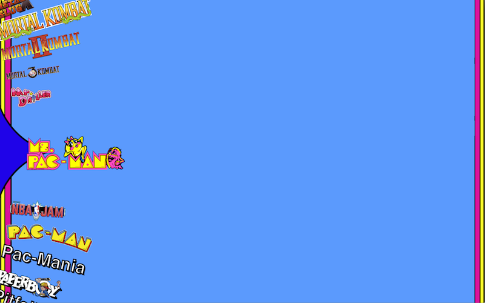

HyperMike
==============

Frontend for my arcade cabinet. Built with node-webkit.



[Hyperspin](http://hyperspin-fe.com/) is glorious to behold. Though, if you are anything like me, you cringe that it only works on Windows and requires a beefy CPU since it runs inside Flash. This is not ideal when all I want is to play Donkey Kong on my arcade cabinet.

Requirements
------------

* Builds for Mac, Windows, and Linux
* Need to have MAME installed and set up with games

Getting Started
---------------

```bash
$ npm install
$ bower install
$ npm run compiler
# Ctrl-C once assets have been compiled
$ (cd _public && npm install)
# Configure config.yml before running! See Configuration
$ npm run app
```

Configuration
-------------

I've included the entire MAME game database inside of `app/assets/config/MAME-full.xml`.
Remove games that you don't want showing up and save to `app/assets/config/MAME.xml`.

I've included a sample config in `app/assets/config/config.sample.yml`

Copy that to `config.yml` and tailor it to your needs. This file is required to run the arcade.

### Themes

Supports Hyperspin wheel and background themes. Be sure to set the location of your themes in config.yml. Folder should be set up like such:

```
dkong/
---dkong.png       # Wheel image
---Background.png  # Background
---Theme.xml       # Animation configuration
```

Building
---------

```bash
$ npm run deploy
```
Look for the release in `dist/releases`

Things that would be cool
-------------

* Re-build UI with Phaser for better performance
* Add support for animated backgrounds
* Add support for game previews/videos
* Instructions at bottom of screen
* Intro Video?
